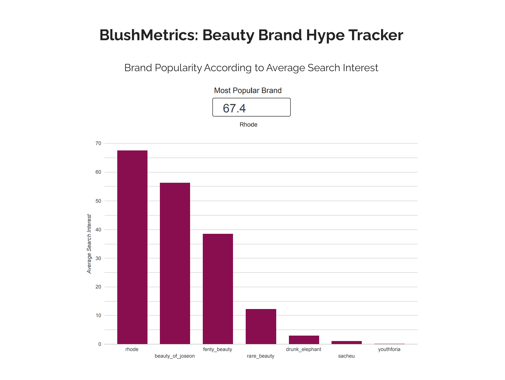
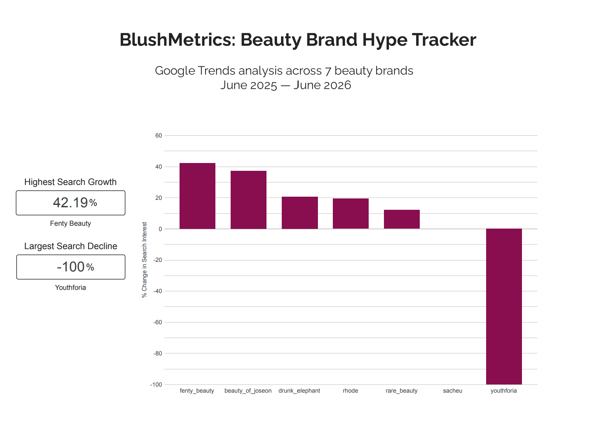

# BlushMetrics
> *Beauty brand hype vs. reality — tracked in the data.*

TikTok moves fast. Founders go viral. Products sell out overnight. 
But when the internet has opinions about a brand — does search 
interest spike, hold, or collapse? BlushMetrics tracks the signal 
underneath the noise.

BlushMetrics is an end-to-end data engineering pipeline tracking Google Trends 
search interest for 7 beauty brands across distinct hype archetypes. 
Built with Python, BigQuery, and dbt.

**[View Live Dashboard](https://datastudio.google.com/reporting/da518e9e-c5c7-4f9d-972a-57d0992c408f)**
---

## The Central Question
When hype hits a beauty brand — a founder controversy, a viral 
product drop, a cultural moment — what actually happens to search 
interest? And does it last?

---

## Brand Lineup
| Brand | Archetype |
|---|---|
| Rhode | Celebrity brand / polarizing founder |
| Rare Beauty | Celebrity brand / sympathy hype |
| Fenty Beauty | Cultural reset / longevity test |
| Beauty of Joseon | K-beauty category wave |
| Drunk Elephant | Generational backlash |
| Sacheu | Pure TikTok virality |
| Youthforia | Reputation collapse |

---

## Stack
| Layer | Tool |
|---|---|
| Data Source | Google Trends via pytrends |
| Cloud Warehouse | BigQuery (GCP) |
| Transformation | dbt |
| Ingestion | Python + pandas |
| Visualization | Data Studio (Looker Studio) |
---

## Pipeline
```
Google Trends (pytrends)
         ↓
Python ingestion script
         ↓
BigQuery (raw layer)
         ↓
dbt (staging → intermediate → mart models)
         ↓
Looker Studio dashboard        
```
---

## dbt Models
**Staging**
- `stg_brand_trends` — cleans raw data, converts date 
  string to DATE type, renames columns to snake_case

**Intermediate**
- `int_google_trends_unpivot` — converts wide format 
  (brands as columns) to long format (brands as rows) 
  using UNPIVOT

**Marts**
- `mart_brand_popularity` — avg search interest per brand 
  + popularity rank via window function
- `mart_brand_momentum` — compares H2 2025 vs H1 2026 
  search interest, calculates % change, classifies brands 
  as Gaining / Maintaining / Losing Momentum

-- 

## Key Findings

**Rhode dominates in raw popularity (67.4 avg search interest)**
but Fenty Beauty leads momentum growth at +42.19%.

**Beauty of Joseon at #2 overall (56.17 avg)**, beating 
Fenty Beauty in raw popularity. K-beauty is not a trend, 
it's a shift.

**Rhode peaked at 100 on 2/15/26** — directly tied to the 
Caffeine Reset + Peptide Lip Boost launch. 

**Beauty of Joseon peaked at 100 on 4/5/26** — part of 
a broader April 2026 spike that lifted all brands 
simultaneously. Likely Coachella/spring beauty season effect.

**Youthforia: -100% momentum. Zero search interest in 2026.**
Brand collapse is not just a narrative; it's visible in 
the data. The shutdown is confirmed by the numbers.

**Sacheu: frozen at 0% change.** TikTok virality doesn't 
compound. The peel-off lip liner moment evaporated completely.

## Dashboard



---

## Why this
I'm a Sephora customer — VIB member, chronically on BeautyTok. I see both sides: brands dropping new products weekly, influencers hyping something different every day. It's easy to get swept up in it. But I started wondering — does the rating actually back up the buzz, or does the hype die in 3 months? BlushMetrics is my attempt to put actual data behind the narrative: to see whether the hype holds, and which brands actually survive their moment. 
